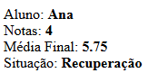
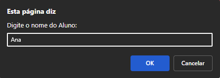

# Sistema de Boletim Escolar

## Descrição
Este projeto é um sistema simples de boletim escolar desenvolvido com o objetivo de calcular a média final de um aluno a partir de quatro notas informadas pelo usuário.

O sistema resolve o problema do cálculo manual da média e da situação final do aluno, automatizando o processo e exibindo o resultado diretamente na tela de forma clara.

O projeto foi desenvolvido como atividade prática do curso Técnico em Informática para Internet, com foco em lógica de programação e JavaScript.

## Prints do Projeto
### Prévia do Projeto

### Etapas do Projeto
 
 
 
 
 
 
## Funcionalidades
- Solicita o nome do aluno
- Solicita quatro notas
- Calcula automaticamente a média final
- Define a situação do aluno:
  - Aprovado com Mérito
  - Aprovado
  - Recuperação
  - Reprovado
- Exibe os dados e o resultado na tela

## Tecnologias Utilizadas
- HTML5  
- CSS3 *(não aplicado neste projeto)*  
- JavaScript  
- Git e GitHub  
- Visual Studio Code  

## Melhorias Futuras

- Criar uma interface visual com formulário HTML
- Adicionar estilização com CSS
- Validar se as notas digitadas são válidas
- Permitir calcular boletim de mais de um aluno
- Exibir os resultados sem uso de prompt

## O que Aprendi

- Uso de variáveis em JavaScript
- Entrada de dados com prompt
- Conversão de valores para número
- Estruturas condicionais (if, else if, else)
- Cálculo de média
- Manipulação do DOM para exibição de dados

## Como Rodar o Projeto
Para executar o projeto em seu computador:

1. Baixe ou clone o repositório
2. Abra a pasta do projeto
3. Execute o arquivo `index.html` em um navegador
4. Preencha as informações solicitadas nos alertas

## Como Clonar o Projeto
1. Acesse o repositório no GitHub
2. Clique no botão **Code**
3. Copie o link do repositório
4. No terminal, execute:
   
https://github.com/angelica-07102009/Senac.git

## Autor

Maria Angelica 

Curso Técnico em Informática para Internet 

Turma de Tecnologia em Informática para Internet (Turno Vespertino) – Senac DF
