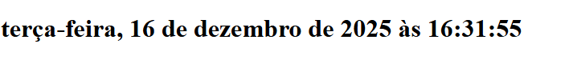

# Calendário Digital

## Descrição
Este projeto é um calendário digital desenvolvido com o objetivo de exibir a data e a hora atualizadas em tempo real no formato brasileiro.

A aplicação resolve o problema de visualizar a data e o horário completos de forma automática, sem necessidade de atualização manual da página, utilizando recursos nativos do JavaScript.

O projeto foi desenvolvido como atividade prática do curso Técnico em Informática para Internet, com foco em manipulação de datas e horários em JavaScript.

## Prints do Projeto

## Funcionalidades
- Exibição da data atual
- Exibição do horário em tempo real
- Atualização automática a cada segundo
- Formatação da data no padrão brasileiro
- Uso da API `Intl.DateTimeFormat`

## Tecnologias Utilizadas
- HTML5  
- CSS3 *(não aplicado neste projeto)*  
- JavaScript  
- Git e GitHub  
- Visual Studio Code  

## Melhorias Futuras

- Adicionar estilização com CSS
- Permitir escolha de idioma e formato de data
- Exibir apenas data ou apenas hora
- Criar versão responsiva com layout mais elaborado

## O que Aprendi

- Trabalhar com objetos Date em JavaScript
- Atualizar conteúdo em tempo real com setInterval
- Utilizar a API Intl.DateTimeFormat
- Manipular elementos do DOM
- Formatar datas e horários automaticamente

## Como Rodar o Projeto
Para executar o projeto em seu computador:

1. Baixe ou clone o repositório
2. Abra a pasta do projeto
3. Execute o arquivo `index.html` em um navegador
4. A data e a hora serão exibidas automaticamente na tela

## Como Clonar o Projeto
1. Acesse o repositório no GitHub
2. Clique no botão **Code**
3. Copie o link do repositório
4. No terminal, execute:

https://github.com/angelica-07102009/Senac.git

## Autor

Maria Angelica

Curso Técnico em Informática para Internet

Turma de Tecnologia em Informática para Internet (Turno Vespertino) – Senac DF
