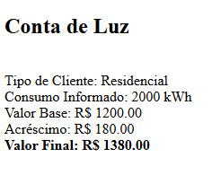
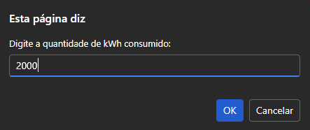
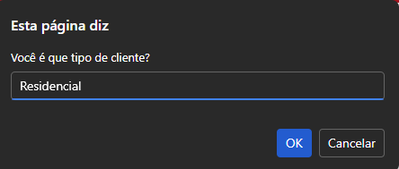
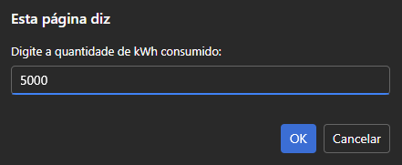
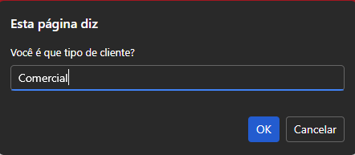
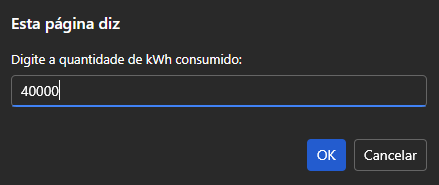
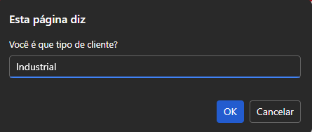

# Calculadora de Conta de Luz

##  Descrição
Este projeto é uma calculadora de conta de luz desenvolvida com o objetivo de calcular o valor final da fatura de energia elétrica com base no consumo em kWh e no tipo de cliente.

A aplicação resolve o problema do cálculo manual do valor da conta, aplicando automaticamente as regras de preço e o acréscimo para consumos elevados, exibindo todas as informações de forma clara na tela.

O projeto foi desenvolvido como atividade prática do curso Técnico em Informática para Internet, com foco em lógica de programação e JavaScript.

## Prints do Projeto
### Prévia do Projeto

-Residencial: 

-Comercial: 

-Resultado Industrial: 

### Etapas do Projeto
-Resincial:

-Comercial:

-Industrial:

## Funcionalidades
- Solicita a quantidade de kWh consumidos
- Solicita o tipo de cliente (Residencial, Comercial ou Industrial)
- Calcula o valor base da conta
- Aplica acréscimo de 15% para consumo acima de 500 kWh
- Exibe valor base, acréscimo e valor final

## Tecnologias Utilizadas
- HTML5  
- CSS3 *(não aplicado neste projeto)*  
- JavaScript  
- Git e GitHub  
- Visual Studio Code  

## Melhorias Futuras

- Criar interface gráfica com formulário HTML
- Adicionar estilização com CSS
- Validar tipo de cliente digitado
- Evitar uso de prompt e exibir mensagens na página
- Adicionar simulação de diferentes tarifas

## O que Aprendi

- Uso de condicionais (if / else if)
- Conversão de dados para número
- Cálculo de valores e porcentagens
- Manipulação do DOM para exibição de resultados
- Uso de prompt para entrada de dados

## Como Rodar o Projeto
Para executar o projeto em seu computador:

1. Baixe ou clone o repositório
2. Abra a pasta do projeto
3. Execute o arquivo `index.html` em um navegador
4. Preencha as informações solicitadas nos prompts

## Como Clonar o Projeto
1. Acesse o repositório no GitHub
2. Clique no botão **Code**
3. Copie o link do repositório
4. No terminal, execute:

git clone https://github.com/seu-usuario/conta-de-luz.git

## Autor

Angelica

Curso Técnico em Informática para Internet

Turma de Tecnologia em Informática para Internet (Turno Vespertino) – Senac DF
