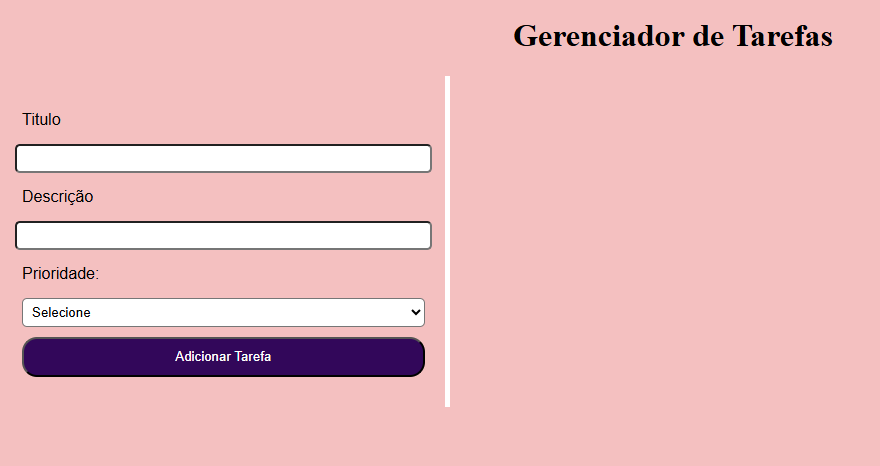
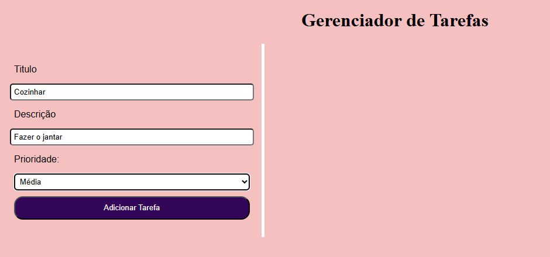
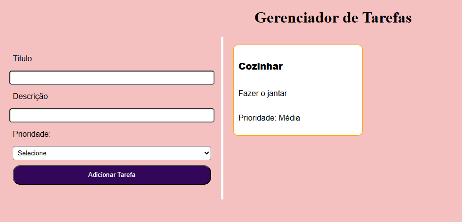

# Gerenciador de Tarefas

## Descrição
Este projeto é um gerenciador de tarefas desenvolvido com o objetivo de permitir o cadastro e a organização de tarefas de forma simples e visual.

A aplicação resolve o problema de anotar e acompanhar tarefas do dia a dia, possibilitando ao usuário informar título, descrição e prioridade, com exibição clara na tela.

O projeto foi desenvolvido como atividade prática do curso Técnico em Informática para Internet, com foco em JavaScript, formulários e manipulação do DOM.

## Prints do Projeto
### Prévia do Projeto

### Etapas do Projeto

## Funcionalidades
- Cadastro de tarefas com título, descrição e prioridade
- Listagem dinâmica das tarefas cadastradas
- Exibição das tarefas em formato de cards
- Diferenciação visual por prioridade:
  - Alta (vermelho)
  - Média (amarelo)
  - Baixa (verde)
- Layout responsivo para diferentes tamanhos de tela

## Tecnologias Utilizadas
- HTML5  
- CSS3  
- JavaScript  
- Git e GitHub  
- Visual Studio Code  

## Melhorias Futuras

- Implementar exclusão de tarefas
- Permitir edição das tarefas
- Salvar tarefas no LocalStorage
- Criar filtro por prioridade
- Melhorar a acessibilidade do layout

## O que Aprendi

- Criação e manipulação de arrays em JavaScript
- Uso de formulários HTML com JavaScript
- Manipulação do DOM
- Uso de eventos (submit)
- Estruturas condicionais (operador ternário)
- Responsividade com CSS

## Como Rodar o Projeto
Para executar o projeto em seu computador:

1. Baixe ou clone o repositório
2. Abra a pasta do projeto
3. Execute o arquivo `index.html` em um navegador
4. Preencha o formulário e clique em **Adicionar Tarefa**

## Como Clonar o Projeto
1. Acesse o repositório no GitHub
2. Clique no botão **Code**
3. Copie o link do repositório
4. No terminal, execute:

git clone https://github.com/seu-usuario/gerenciador-de-tarefas.git

## Autor

Maria Angelica

Curso Técnico em Informática para Internet

Turma de Tecnologia em Informática para Internet (Turno Vespertino) – Senac DF
