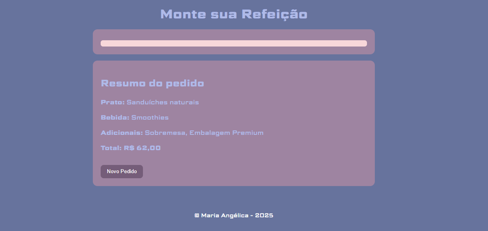
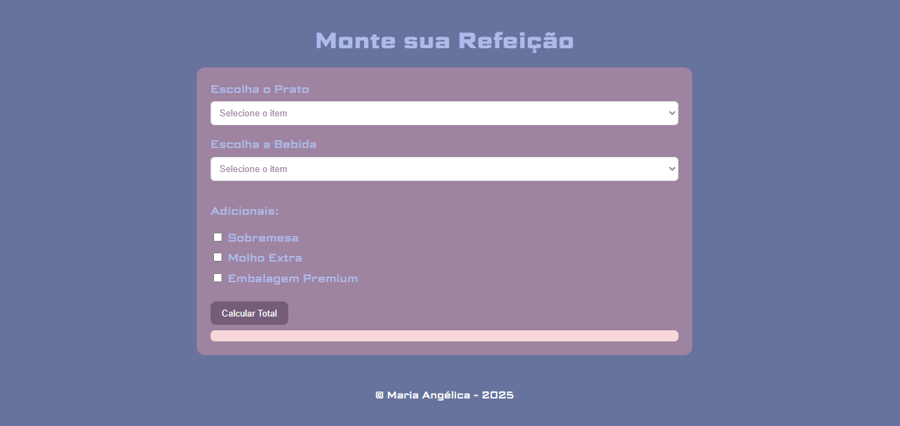
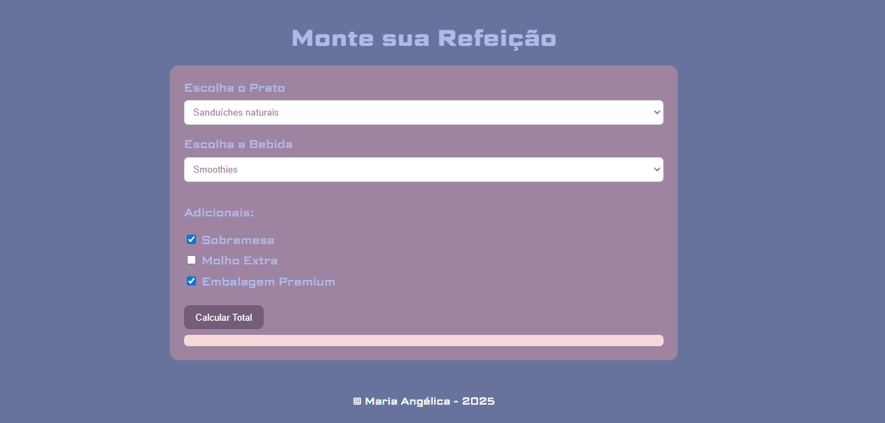

# Monte sua Refeição

## Descrição
Este projeto é uma aplicação web que permite ao usuário montar sua própria refeição escolhendo um prato, uma bebida e adicionais, calculando automaticamente o valor total do pedido.

A aplicação resolve o problema de cálculo manual de pedidos, garantindo uma experiência simples, interativa e clara para o usuário, com validações e exibição de um resumo final da compra.

O projeto foi desenvolvido como atividade prática do curso Técnico em Informática para Internet, com foco em JavaScript, formulários e manipulação do DOM.

## Prints do Projeto
### Prévia do Projeto

### Etapas do Projeto

## Funcionalidades
- Seleção de prato principal
- Seleção de bebida
- Escolha de adicionais
- Cálculo automático do valor total
- Validação de campos obrigatórios
- Exibição do resumo do pedido
- Opção de realizar um novo pedido

## Tecnologias Utilizadas
- HTML5  
- CSS3  
- JavaScript  
- Git e GitHub  
- Visual Studio Code  

## Melhorias Futuras

- Adicionar imagens dos pratos e bebidas
- Criar categorias de refeições
- Melhorar responsividade para telas menores
- Implementar sistema de pedidos com histórico
- Integrar com backend futuramente

## O que Aprendi

- Manipulação de formulários em JavaScript
- Validação de dados de entrada
- Uso de objetos para armazenar preços
- Manipulação do DOM
- Uso de eventos (addEventListener)
- Organização de arquivos HTML, CSS e JS

## Como Rodar o Projeto
Para executar o projeto em seu computador:

1. Baixe ou clone o repositório
2. Abra a pasta do projeto
3. Execute o arquivo `index.html` em um navegador
4. Escolha os itens desejados e clique em **Calcular Total**

## Como Clonar o Projeto
1. Acesse o repositório no GitHub
2. Clique no botão **Code**
3. Copie o link do repositório
4. No terminal, execute:

git clone https://github.com/angelica-07102009/Senac.git

## Autor

Maria Angelica

Curso Técnico em Informática para Internet

Turma de Tecnologia em Informática para Internet (Turno Vespertino) – Senac DF
